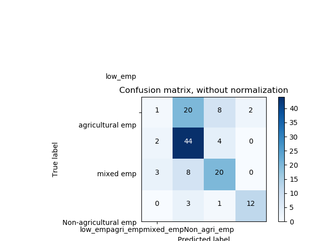

# Nightlight_crop_cover_mask

Predict Employment cluster labels and source of lighting cluster labels.

Nightlight data:
There are several type of nightlight data extracted at district level. We tried dividing intensity from 0-63 into various bins but 64 bins work out best.
a. 64 length vector containing no. of pixels with intensity ranging from 0-63.
b. 64 length vector containing no of pixels with intensity ranging from 0-63 when the pixels with crop-cover are masked out.
c. 128 length vector containing no. of pixels with intensity ranging from 0-63 if it is masked or unmasked.

All the districts are split into 80-20 train-test datset. We tried different supervised learning algorithms like SVM, random forest,MLP classifier and unsupervised learning method like KMeans clustering.

Running classifer:

Set the path of data which is to be used for classification

python classifier.py

Plotting box plot:

Set the path of data whose boxplot is to be plotted.

python plot_boxplot.py

Results:

Using Random forest classifer

Accuracy on test data:

Predicting employment clusters:
a. Unmasked Nightlight

Test accuracy:  54.69 %

Train accuracy: 90.23 %

Confusion matrix:

b. Masked Nightlight:   

Test accuracy: 62.5 % 

Train accuracy: 94.14% 

Confusion matrix:

c.Using 128 length feature vector :  

Test accuracy:  60.16% 

Train accuracy: 91.99%

Confusion matrix:

Boxplot for Mean NTL and source of lighting:

Masked mean NTL and Source of lighting:

Mean NTL and Employment clusters:

Masked mean NTL and employment clusters:

